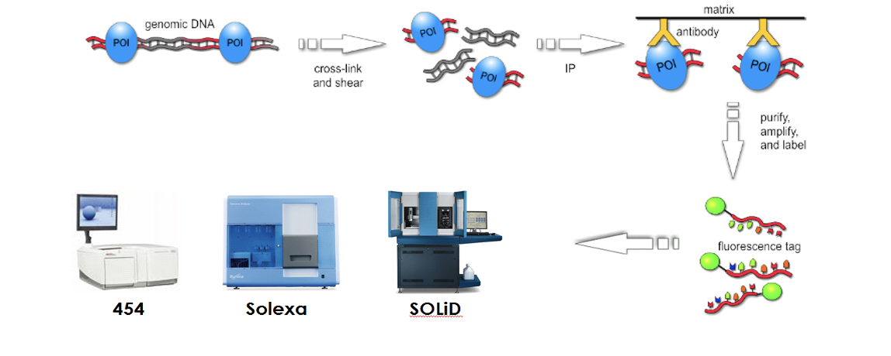
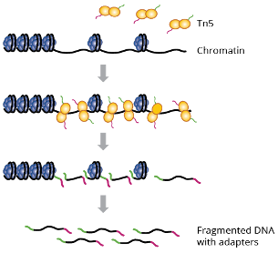

# Multi-omic Analysis of ADIR1A knockout on Triple Negative Breast Cancer

Tripe negative breast cancer (TNBC) is defined as the tumor that lacks the receptor expression of estrogen, progesterone and a protein HER2 expression [1]. The AT-rich interactive domain 1A (ARID1A) is the region that is mostly depleted in many human cancers. It encodes protein BAF250a and it is observed to be downregulated in tumor tissues. ARID1A plays and essential role in tumor suppression by negative regulation of cell-cycle progression and identifying the target genes to mediate the tumor suppression [2].

**ChIP-seq** is a sequencing technology which is used to map the DNA-binding proteins and histone modifications. The ChIP antibodies target a specific protein of interest and attaches to them, which enriches the DNA fragments bound to those proteins [3]. The DNA fragments which contain the protein of interest are extracted and amplified and sequence to study the effects.

  

Mammalian DNA is highly condensed through nucleosome which wraps into chromatin which leads into chromosome. Chromatin is mainly made of DNA and protein and dynamically switches between active euchromatin (loosely bound and easily accessible by TF) and inactive heterochromatin (Tightly bound). The interplay between nucleosome, chromatin, and chromosome
play an important role in gene regulation. **ATAC-seq** studies the chromatin accessibility by incorporating genetically altered Tn5 transposase that cuts open chromatin and ligates adapters [4].

  

In this project integration of ATAC-seq, ChIP-seq and RNA-seq analysis was performed in the context of ARID1A knockout versus control samples to understand the mechanisms of gene
expression regulation. This integration offers an understanding on how histone modifications caused by knockout of ARID1A impact the accessibility of DNA, thereby regulating the gene
expression.

## METHODS

